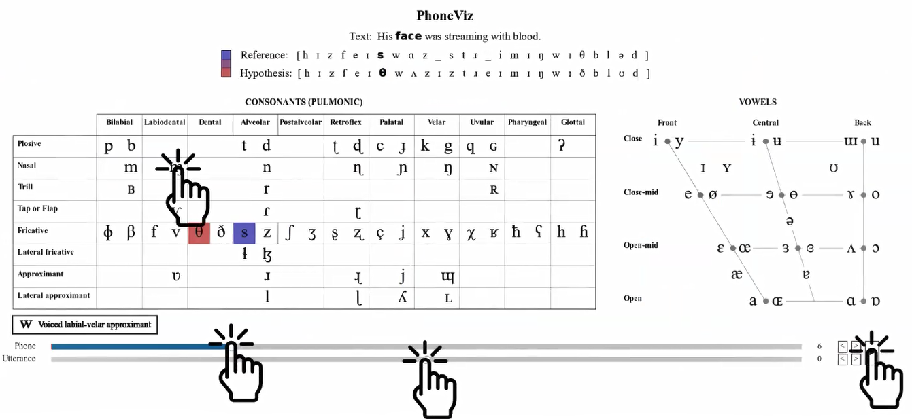
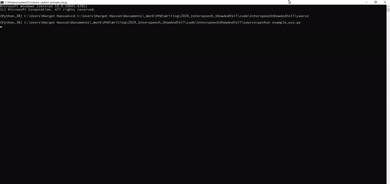

# PhoneViz: phone alignment visualiser



PhoneViz is a phone alignment visualiser which facilitates a deeper analysis of the phone alignments typically used to compare a reference transcription and a concrete speaker pronunciation. PhoneViz provides an interactive environment where aligned phones are displayed in the IPA chart helping users to explore phonetic variation beyond symbol substitution, insertion and deletion. This repository contains the code and resources for the phone alignment visualiser: ASR, alignment computation and Phones Visualiser.

## Installation and setup

The most recent version of this code can be cloned from this repository using the command:

```bash
git clone https://github.com/MargotUCD/PhoneViz.git
```

Install all the required packages to run the code using this command:

```bash
pip install -r requirements.txt
```

Once the repository has been cloned, you'll find the source code in `source`. The resources needed to compute the alignments and run the visualiser can be found in `resources`. 

## Key features and usage

### Utils

The class ```Text``` is used for English grapheme to IPA / ARPABET phoneme conversion.

### ASR and alignment

ASR can be performed using the methods in the ```AutomaticSpeechRecognition``` class. The subclass ```Wav2Vec2ASR``` allows to run wav2vec2.0 for text and phoneme recognition, using the ```recognize_text(input_path)``` method. Alignment, under the class ```SCLiteAlignment``` allows to compute the alignment between reference and hypothesis text and phonemes. The method ```get_confusions(hyp, ref)``` computes the alignment between the reference and the hypothesis and returns the aligned reference and aligned hypothesis in ```Series``` format.

### Running the whole pipeline and PhoneViz display

The class ```ShowTellPipeline``` allows for running the whole audio files -> ASR -> alignment pipeline. The class ```PhoneViz``` allows to display the generated alignments in PhoneViz.

Example usage below and in the Python file ```example_use.py```.

**0. Simple run using ```example_use.py```**
```bash
python example_use.py
```
Then you can choose one of the three modes. Example configurations are:
* Mode 0: ```EBVS_arctic_a0001.wav``` || ```Author of the danger trail, Philip Steels, etc.```
* Mode 1: ```demonstration_dataset_without_alignments.csv```
* Mode 2: ```demonstration_dataset_with_alignments.csv```



**1. Example use for one audio (mode 0)**
The path to the audio file should be relative to the ```data\\utterances``` folder.
```python
    pipeline_obj = ShowTellPipeline()

    philip_stilz_file_name = "EBVS_arctic_a0001.wav"
    philip_stilz_ref_text = "Author of the danger trail, Philip Steels, etc."
```
To get the full alignment and display it in PhoneViz:
```python
    PhoneViz().phoneviz(pipeline_obj.single_pipeline(philip_stilz_file_name,philip_stilz_ref_text))
```
**2. Example use for a dataframe without alignments**
The dataframe should contain only the columns "file_name" and "reference_text".
```python
    project_path = (os.path.dirname(os.path.abspath("__file__"))).replace("source", "")
    test_df = pd.read_csv(project_path+"data\\alignments\\l2arctic_head_without.csv")
```
To get the full alignments and display it in PhoneViz:
```python
    PhoneViz().phoneviz(pipeline_obj.dataframe_pipeline(test_df))
```
**3. Example use for a dataframe without alignments**
The dataframe should contain the columns 
                    "file_name" : the relative path to the audio file,
                    "reference_text" : the reference text in string format,
                    "reference_phonemes" : the reference phones as a word by word list in string format, 
                    "hypothesis_phonemes" : the hypothesis phones as a list in string format, 
                    "ref_pho_align" : the aligned reference phones as a phone by phone list in string format, 
                    "hyp_pho_align" : the aligned hypothesis phones as a phone by phone list in string format.
For reference, see ```demonstration_dataset_with_alignments.csv```
```python
    project_path = (os.path.dirname(os.path.abspath("__file__"))).replace("source", "")
    test_df = pd.read_csv(project_path+"data\\alignments\\"+l2arctic_head_with.csv")
```
To get the full alignments and display it in PhoneViz:
```python
    PhoneViz().phoneviz(test_df)
```

## Acknowledgements
This work was conducted with the financial support of the Science Foundation Ireland (SFI) Centre for Research Training in Digitally-Enhanced Reality (d-real) under Grant No. 18/CRT/6224 and the ADAPT SFI Research Centre under Grant Agreement No. 13/RC/2106 P2 at University College Dublin.

## Reference
Please cite the following paper if you use code in your work.
```BibTex
@inproceedings{masson24_interspeech,
  title     = {PhoneViz: exploring alignments at a glance},
  author    = {Margot Masson and Erfan A. Shams and Iona Gessinger and Julie Carson-Berndsen},
  year      = {2024},
  booktitle = {Interspeech 2024},
  pages     = {3648--3649},
  issn      = {2958-1796},
}
```
